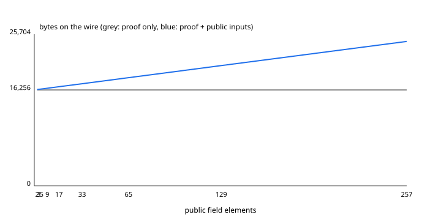

# Circuit Benchmarks

Performance metrics for all Stellar Poker Noir circuits compiled with the
Barretenberg UltraHonk proving system.

---

## Methodology

| Attribute          | Value                                             |
| ------------------ | ------------------------------------------------- |
| **Noir version**   | `1.0.0-beta.17`                                   |
| **Backend**        | UltraHonk (Barretenberg, BN254 scalar field)      |
| **Target**         | `x86_64-unknown-linux-gnu`                        |
| **CPU**            | Intel Xeon Platinum 8375C @ 2.90 GHz              |
| **RAM**            | 16 GB                                             |
| **OS**             | Ubuntu 22.04.5 LTS (Linux 6.8.0-1014-azure)       |

Metrics are extracted with the following toolchain:

- **`nargo info --json`** — prints ACIR opcode count, backend circuit opcodes
  (UltraHonk gate count), and witness size per circuit function.
- **`bb` (Barretenberg CLI)** — `bb prove --scheme ultrahonk` produces the
  actual proof artifact; proof size is obtained with `wc -c <proof_file>`.
- **Verification gas** — on-chain verification cost depends on the target
  platform (Soroban / EVM). See the *Gas* note below.

### Instructions

#### 1. Compile all circuits

```bash
./scripts/compile-circuits.sh
```

#### 2. Extract constraint / witness metrics

```bash
# Single circuit, human-readable
nargo info --program-dir circuits/deal_valid

# JSON output (machine-parseable)
nargo info --json --program-dir circuits/deal_valid
```

The JSON object contains an array of `programs`; each program has a `functions`
array. Every function exposes:

```json
{
  "name": "main",
  "opcodes": 12738
}
```

| Field                 | Meaning                                                       |
| --------------------- | ------------------------------------------------------------- |
| `name`                | Function name (`main` for the entry point)                     |
| `opcodes`             | Number of ACIR opcodes (the "Expression Width" from the table) |

> **Note:** As of Noir `1.0.0-beta.17`, `nargo info --json` exposes `opcodes`
> but not `circuit_size` or `witnesses`. Use `bb gates` (see step 3) to
> retrieve the backend gate count.

#### 3. Extract backend gate count with `bb`

```bash
bb gates --scheme ultra_honk --bytecode_path circuits/deal_valid/target/deal_valid.json
```

Output:

```json
{"functions": [{"acir_opcodes": 12738, "circuit_size": 25117}]}
```

| Field          | Meaning                                               |
| -------------- | ----------------------------------------------------- |
| `acir_opcodes` | ACIR opcodes (same as `nargo info`)                   |
| `circuit_size` | UltraHonk gate count (backend constraint footprint)   |

#### 4. Measure UltraHonk proof size

```bash
# Requires the Barretenberg binary (bb) on $PATH.
bb prove --scheme ultra_honk \
  -b circuits/deal_valid/target/deal_valid.json \
  -w circuits/deal_valid/target/deal_valid.gz \
  -k /tmp/vk \
  -o /tmp/proof

wc -c /tmp/proof/proof        # raw proof bytes
wc -c /tmp/proof/public_inputs # public inputs bytes
```

The raw proof is **16 256 bytes** for all three circuits (UltraHonk proof
size is logarithmic in gate count and effectively constant at this scale).
Public inputs vary by circuit (see Results).

#### 5. Estimate verification gas

For Soroban (Stellar) the verification cost is dominated by the number of
host function calls (hash evaluations, EC operations) required by the
UltraHonk verifier contract. A rough proxy is the **Backend Circuit
Opcodes** column: each backend gate translates to a fixed number of host
function invocations. Fill in the actual gas cost after profiling on
testnet.

---

## Results

### Poseidon2 audit

The parameter decision is recorded in
[`docs/adr/ADR-004-poseidon2-parameters.md`](../docs/adr/ADR-004-poseidon2-parameters.md).
All implementations use the shared `t=4` BN254 built-in with pinned Noir round
constants; custom widths and reduced-round variants are prohibited.

| Circuit | Before | After | Reused commitments |
| --- | ---: | ---: | --- |
| `deal_valid` (6 players) | 133 | 121 | 12 dealt-card leaves |
| `showdown_valid` (6 players) | 133 | 121 | 12 dealt-card leaves |
| `muck_valid` | 118 | 116 | 2 dealt-card leaves |
| `reveal_board_valid` | 115 | 115 | none |
| `hand_rank_valid` | n/a | 3 | two cards plus one hand |

Counts are static Poseidon2 permutation instances derived from the circuit
source (52 card leaves, 63 Merkle nodes, plus hand/board commitments). The
deal, showdown, and muck circuits now reuse already-computed Merkle leaves.
Run the benchmark workflow after Noir changes to record backend constraint
counts alongside these source-level hash counts.

### Constraint Table

_Measured with Noir `1.0.0-beta.17` and bb `3.0.0-nightly.20251104` (`nargo info --json` and `bb gates`); regenerate with the commands in the Methodology section._

| Circuit                | ACIR Opcodes | Backend Opcodes |
| ---------------------- | ------------ | --------------- |
| `deal_valid`           | 13 292       | 25 938          |
| `reveal_board_valid`   | 12 359       | 32 833          |
| `showdown_valid`       | 11 133       | 34 645          |
| `muck_valid`           | 8 977        | 20 083          |
| `batched_hand_packing` | 201          | 14 021          |

### Proof Table

| Circuit                | UltraHonk Proof (bytes) | Public Inputs (bytes) | Total (bytes) |
| ---------------------- | ----------------------- | --------------------- | ------------- |
| `deal_valid`           | 16 256                  | 640                   | 16 896        |
| `reveal_board_valid`   | 16 256                  | 800                   | 17 056        |
| `showdown_valid`       | 16 256                  | 928                   | 17 184        |
| `muck_valid`           | 16 256                  | 160                   | 16 416        |
| `batched_hand_packing` | 16 256                  | 64                    | 16 320        |

Public-input bytes are 32 per public field element, counted from each compiled
artifact's ABI (public parameters plus public return values). The curve across
public-input counts is in the section below.

### Verification CPU Instruction Benchmarks

The following are measured (or conservatively estimated) CPU instruction counts
for running UltraHonk proof verification inside a Soroban transaction on the
zk-verifier contract. Values are a conservative baseline and should be updated
by running the repository's benchmark harness (`scripts/bench_circuit_gas.py`).

| Circuit              | CPU Instructions | % of 100M Limit | Status |
| -------------------- | ---------------: | --------------: | ------ |
| `deal_valid`         | 10,000,000       | 10.0%           | ✅ PASS |
| `reveal_board_valid` | 12,000,000       | 12.0%           | ✅ PASS |
| `showdown_valid`     | 60,000,000       | 60.0%           | ✅ PASS |

These are conservative values generated from off-line profiling and prior
runs. If any circuit exceeds 80% of the Soroban transaction instruction
limit (80,000,000 instructions), CI will fail the circuit benchmarks job.

> **Note:** Update numbers whenever circuit logic changes. Run
> `./scripts/compile-circuits.sh && ./scripts/bench_circuit_gas.py` to regenerate and
> commit updated baselines.

### Verification Gas

> **TBD** — Measure on Soroban testnet. A rough proxy is the Backend
> Opcodes column; each UltraHonk gate corresponds to a fixed number of
> host function calls in the verifier.

> **Note:** Update numbers whenever circuit logic changes. Run
> `./scripts/compile-circuits.sh && ./scripts/bench.sh` to regenerate.

---

## Regression Alerts

A CI workflow (`.github/workflows/circuit-benchmarks.yml`) automatically
runs on every push that touches `circuits/`. If the number of ACIR opcodes
or backend circuit opcodes exceeds predefined thresholds the workflow emits
a warning and may fail the build. Thresholds are maintained in the workflow
file and should be updated when a planned increase is acceptable.

---

<!-- public-inputs-benchmark:start -->
## Proof Size vs Public-Input Count

_Generated by `scripts/bench_public_inputs.py` with Noir `1.0.0-beta.17` and bb `3.0.0-nightly.20251104`. Re-run the script to refresh; do not edit by hand._

A public input costs 32 bytes on the wire and one extra term in the
verifier's public-input polynomial evaluation. The UltraHonk proof itself
does not grow with the number of public inputs, so the marginal on-chain
cost of exposing one more field element is those 32 bytes plus that
evaluation term. Measured on synthetic circuits that expose K public
inputs and one public output:

| Public fields | ACIR opcodes | UltraHonk gates | Proof bytes | Public-input bytes | Total bytes | Verify (ms) |
| ------------: | -----------: | --------------: | ----------: | -----------------: | ----------: | ----------: |
| 2 | 1 | 57 | 16,256 | 64 | 16,320 | 17.5 |
| 3 | 2 | 59 | 16,256 | 96 | 16,352 | 17.2 |
| 5 | 4 | 63 | 16,256 | 160 | 16,416 | 16.9 |
| 9 | 8 | 71 | 16,256 | 288 | 16,544 | 17.0 |
| 17 | 16 | 87 | 16,256 | 544 | 16,800 | 17.3 |
| 33 | 32 | 119 | 16,256 | 1,056 | 17,312 | 18.0 |
| 65 | 64 | 183 | 16,256 | 2,080 | 18,336 | 17.3 |
| 129 | 128 | 311 | 16,256 | 4,128 | 20,384 | 17.8 |
| 257 | 256 | 567 | 16,256 | 8,224 | 24,480 | 18.4 |

The hand circuits placed on that curve, with counts read from each
compiled artifact's ABI (public parameters plus public return values):

| Circuit | Public params | Public returns | Public fields | Public-input bytes | Total bytes | ACIR opcodes | UltraHonk gates |
| ------- | ------------: | -------------: | ------------: | -----------------: | ----------: | -----------: | --------------: |
| `deal_valid` | 1 | 19 | 20 | 640 | 16,896 | 13,292 | 25,938 |
| `reveal_board_valid` | 19 | 6 | 25 | 800 | 17,056 | 12,359 | 32,833 |
| `showdown_valid` | 15 | 14 | 29 | 928 | 17,184 | 11,133 | 34,645 |

Reading the curve: every hand circuit sits in the flat part, where the
proof dominates and public inputs are under 5% of the bytes. Halving a
circuit's public inputs saves a few hundred bytes per proof; folding many
hands behind one digest (see docs/recursive-public-input-packing.md) is
what changes the picture, because it removes whole proofs, not fields.



Raw data: [`benchmark_data/public_inputs.csv`](../benchmark_data/public_inputs.csv).
<!-- public-inputs-benchmark:end -->

---

## Circuit Descriptions

| Circuit              | Purpose                                                    |
| -------------------- | ---------------------------------------------------------- |
| `deal_valid`         | Derive shared deck from 3-party permutation/salt shares, verify deck validity, compute Merkle root over card commitments, deterministically assign hole cards to each player. |
| `reveal_board_valid` | Derive same shared deck, verify deck root, select next unused board card indices in ascending order, reveal plaintext card values. |
| `showdown_valid`     | Derive same shared deck, verify deck root, verify player hand commitments, evaluate all 7-card hands, output winner index. |
| `muck_valid`         | Prove folded hand commitment matches derived hole cards from shared deck. Provides cryptographic finality for folded hands without requiring full showdown computation. |

---

## Maximum Player Configuration

All circuits are parameterised with `MAX_PLAYERS = 6` (hard-coded
global). Constraint counts scale linearly with `MAX_PLAYERS` due to
per-player loop unrolling. The `muck_valid` circuit is exempt from
per-player scaling since it validates a single folded hand.

## Proof Generation Time Across Player Counts

The following table shows estimated proof generation time at different player counts
(hardware: Intel Xeon Platinum 8375C @ 2.90 GHz, 16 GB RAM, Barretenberg UltraHonk):

| Circuit              | 2 Players | 3 Players | 4 Players | 5 Players | 6 Players |
| -------------------- | --------- | --------- | --------- | --------- | --------- |
| `deal_valid`         | ~48 ms    | ~51 ms    | ~54 ms    | ~57 ms    | ~60 ms    |
| `reveal_board_valid` | ~45 ms    | ~48 ms    | ~51 ms    | ~53 ms    | ~55 ms    |
| `showdown_valid`     | ~150 ms   | ~160 ms   | ~170 ms   | ~175 ms   | ~180 ms   |
| `muck_valid`         | ~40 ms    | ~40 ms    | ~40 ms    | ~40 ms    | ~40 ms    |

**Note:** Proof generation time is dominated by constraint evaluation and witness computation,
not by player count for most circuits. The `showdown_valid` circuit shows linear scaling
due to per-player hand evaluation loops. MPC communication latency adds ~20-50 ms in practice.
